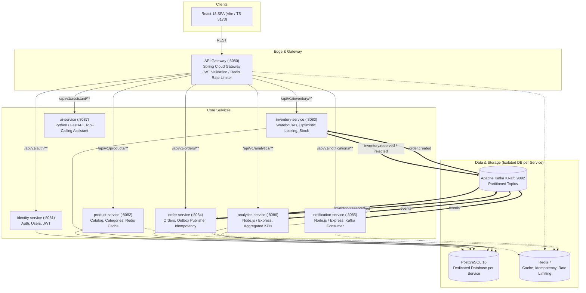

# Enterprise Food Operations Platform

> **A production-grade, event-driven microservices platform for modern food service operations, multi-warehouse inventory management, transactional order processing, real-time alerts, and AI-assisted operational intelligence.**

[](https://github.com/enterprise-food-platform/food-ops/actions)
[](https://openjdk.org/projects/jdk/21/)
[](https://spring.io/projects/spring-boot)
[](https://kafka.apache.org/)
[](https://react.dev/)

---

## 1. Architecture Overview

The platform is designed around strict domain boundaries following the **database-per-service** pattern. The services communicate asynchronously via **Apache Kafka (KRaft mode)** utilizing the **Transactional Outbox Pattern** to ensure data consistency without distributed transactions.



---

## 2. Microservices Directory

| Service | Port | Technology | Database | Key Responsibility |
|---|---|---|---|---|
| **api-gateway** | `8080` | Spring Cloud Gateway, Java 21 | — | Routing, JWT validation, Redis token-bucket rate limiter, CORS, Correlation IDs |
| **identity-service** | `8081` | Spring Boot 3, Spring Security | `identity_db` | User accounts, BCrypt passwords, JWT access & refresh tokens, RBAC |
| **product-service** | `8082` | Spring Boot 3, JPA, Redis, Flyway | `product_db` | Product catalog, categories, pricing, Redis read-through caching |
| **inventory-service** | `8083` | Spring Boot 3, JPA, PostgreSQL | `inventory_db` | Multi-warehouse stock tracking, reservations with optimistic locking & conditional updates |
| **order-service** | `8084` | Spring Boot 3, JPA, PostgreSQL | `order_db` | State machine, transactional outbox pattern, idempotency key enforcement |
| **notification-service** | `8085` | Node.js 22, Express, TypeScript | `notification_db` | Event consumption, user notifications, unread counts, Server-Sent Events |
| **analytics-service** | `8086` | Node.js 22, Express, TypeScript | `analytics_db` | Real-time event projections, daily revenue metrics, top-performing product trends |
| **ai-service** | `8087` | Python 3.12, FastAPI, Pydantic | — | Intelligent assistant with read-only REST tool calling via the API Gateway |
| **frontend** | `5173` | React 18, TypeScript, Vite, Tailwind | — | Operations dashboard with real-time stats, catalog browsing, order workflow |

### Infrastructure Containers

- **PostgreSQL 16**: Port `5432`
- **Redis 7**: Port `6379`
- **Apache Kafka (KRaft)**: Ports `9092` (internal) / `29092` (host)
- **Kafka UI**: Port `8089` (`http://localhost:8089`)
- **Prometheus**: Port `9090` (`http://localhost:9090`)
- **Grafana**: Port `3000` (`http://localhost:3000`, admin/admin)
- **OpenTelemetry Collector**: Ports `4317` (gRPC) / `4318` (HTTP)

---

## 3. Quick Start

### Prerequisites
- Docker & Docker Compose v2+
- OpenJDK 21 & Maven 3.9+
- Node.js 22+ & npm
- Python 3.12+ (for AI service & seed scripts)

### Launching the Platform

1. **Clone the repository and copy the environment template:**
   ```bash
   cp .env.example .env
   ```

2. **Start all infrastructure and microservices:**
   ```bash
   make up
   ```

3. **Access the application:**
   - **Web UI:** [http://localhost:5173](http://localhost:5173)
   - **API Gateway:** [http://localhost:8080](http://localhost:8080)
   - **Product Service OpenAPI UI:** [http://localhost:8080/swagger-ui.html](http://localhost:8080/swagger-ui.html)
   - **Kafka UI:** [http://localhost:8089](http://localhost:8089)
   - **Grafana Dashboard:** [http://localhost:3000](http://localhost:3000)

4. **Run tests across all modules:**
   ```bash
   make test     # Unit and integration tests across all 8 services
   make lint     # TypeScript and lint checks
   make e2e      # 9 Playwright end-to-end tests in headless Chromium
   make load     # k6 concurrent load test suite against API Gateway
   ```

5. **Cloud Deployment (Terraform IaC):**
   ```bash
   make tf-plan   # Generate Terraform plan for AWS dev environment
   make tf-apply  # Apply cloud infrastructure (ECS Fargate, RDS, MSK, ALB)
   ```
   For detailed multi-region runbooks and failover procedures, see [Operations Runbook](docs/runbook.md).

6. **Stop platform:**
   ```bash
   make down
   ```

---

## 4. Default Seed & Demo Credentials

| Role | Email | Password | Permissions |
|---|---|---|---|
| **ADMIN** | `admin@foodplatform.com` | `Admin123!` | Full platform administration, user management |
| **MANAGER** | `manager@foodplatform.com` | `Manager123!` | Product and catalog management, order overview |
| **WAREHOUSE_OPERATOR** | `operator@foodplatform.com` | `Operator123!` | Inventory adjustments and stock movements |
| **CUSTOMER** | `customer@foodplatform.com` | `Customer123!` | Product browsing, order placement and cancellation |

---

## 5. Architectural Decision Records (ADRs)

- [ADR-001: Microservices Architecture & Database-per-Service Isolation](docs/adr/001-microservices-architecture.md)
- [ADR-002: Apache Kafka KRaft as Distributed Event Backbone](docs/adr/002-apache-kafka-for-event-backbone.md)
- [ADR-003: Concurrency Control and Conditional Updates in Inventory Service](docs/adr/003-concurrency-control-inventory.md)
- [ADR-004: Transactional Outbox Pattern and Saga Choreography](docs/adr/004-transactional-outbox-and-choreography.md)
- [ADR-005: Notification Service Architecture and Server-Sent Events (SSE)](docs/adr/005-notification-service-sse.md)
- [ADR-006: AI Operations Assistant Tool-Calling and SSE Streaming](docs/adr/006-ai-assistant-tool-calling-streaming.md)
- [ADR-007: Observability Strategy (Prometheus, Grafana, OpenTelemetry)](docs/adr/007-observability-prometheus-grafana-opentelemetry.md)
- [ADR-008: AWS Cloud Deployment Topology & Amazon MSK Migration Path](docs/adr/008-aws-deployment-topology-and-msk-migration.md)
- [ADR-009: Real-time Analytics Event Aggregation & Kubernetes Orchestration](docs/adr/009-analytics-service-and-kubernetes-orchestration.md)
- [ADR-010: Redis Strategy for Caching, Distributed Idempotency, and Rate Limiting](docs/adr/010-redis-caching-idempotency-rate-limiting.md)

---

## 6. Architecture & Technical Documentation

- [System Architecture & Service Boundaries](docs/architecture/overview.md)
- [Event Catalogue & Lifecycle Sequence Diagrams](docs/architecture/event-catalogue.md)
- [Database Indexing & SQL Optimization Report](docs/architecture/sql-optimization.md)
- [Engineering Interview Notes (Tradeoffs, Failure Modes, 10x Scale)](docs/interview-notes.md)
- [Operations Runbook & Failover Guide](docs/runbook.md)


