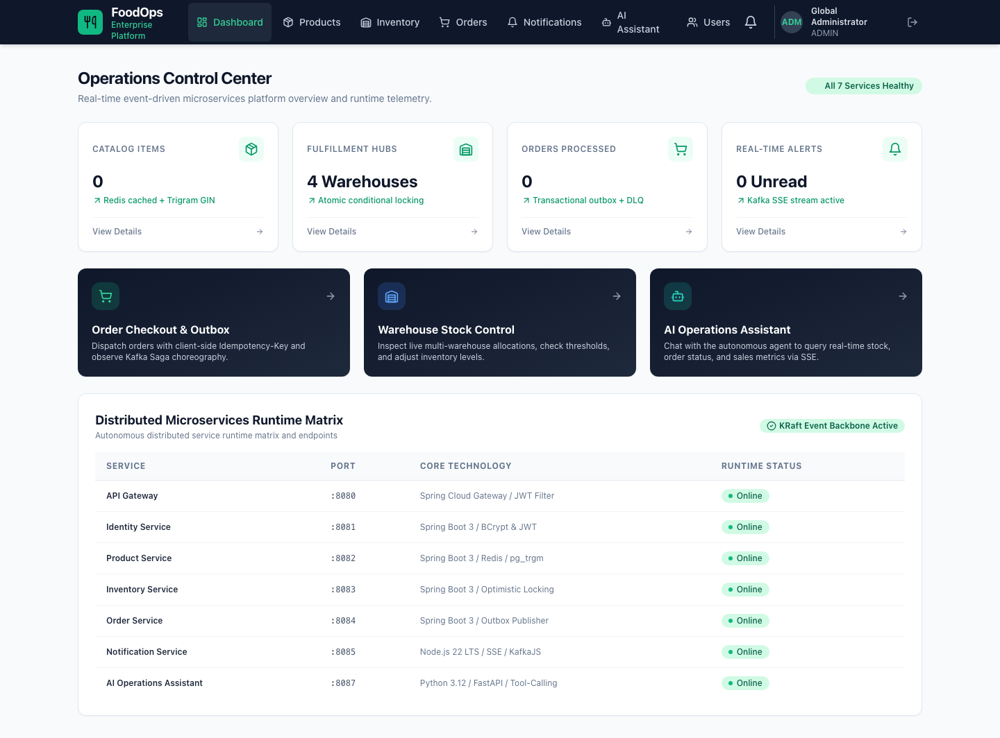
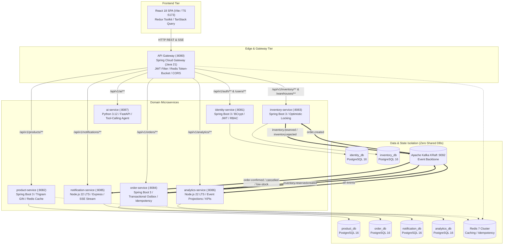
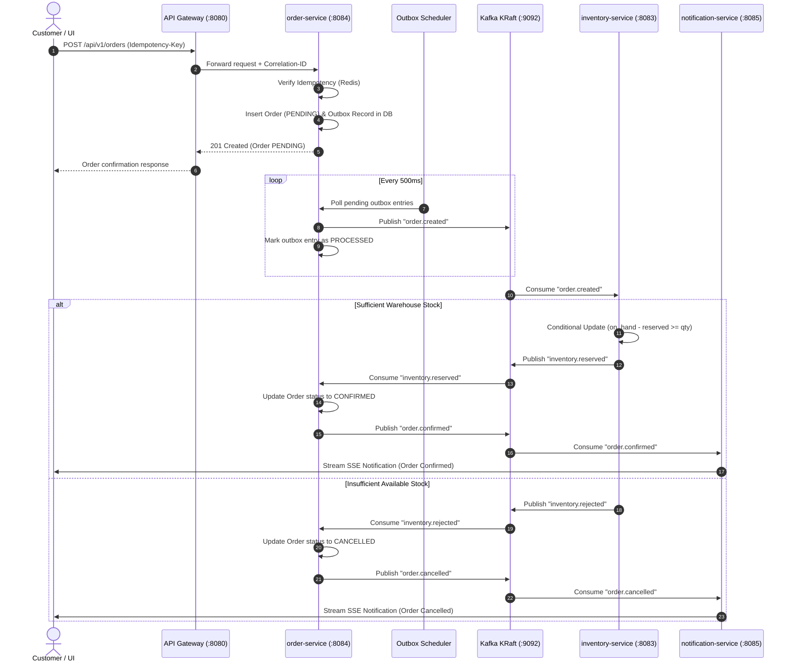

# Enterprise Food Operations Platform

> **A production-grade, event-driven microservices platform for modern food service operations, multi-warehouse inventory management, transactional order processing, real-time alerts, and AI-assisted operational intelligence.**

[]()
[](https://openjdk.org/projects/jdk/21/)
[](https://spring.io/projects/spring-boot)
[](https://kafka.apache.org/)
[](https://www.postgresql.org/)
[](https://redis.io/)
[](https://react.dev/)
[](https://fastapi.tiangolo.com/)
[](https://www.docker.com/)

---

## Operations Control Center (Live UI)



---

## 1. System Architecture & Topology

The platform adheres to strict domain-driven boundaries and the **Database-per-Service** pattern. Synchronous traffic is handled via **Spring Cloud Gateway** with JWT authentication and Redis rate limiting. Asynchronous cross-service communication flows through **Apache Kafka (KRaft mode)** utilizing the **Transactional Outbox Pattern** to ensure data consistency without distributed 2PC locks.



---

## 2. Event-Driven Choreography Saga

All order allocations are managed using asynchronous **Choreography Sagas**. A transactional outbox in `order-service` guarantees that order creation and event emission remain strictly atomic within PostgreSQL.



---

## 3. Technology Stack & Design Rationale

| Layer | Technology | Version | Rationale & Architectural Purpose |
|---|---|---|---|
| **Frontend** | React, TypeScript, Vite, Tailwind | `18.3` | Ultra-fast client build with responsive UI, real-time status banners, and demo user fast-switching. |
| **State & Cache** | Redux Toolkit, TanStack Query | `2.x / 5.x` | Clean client auth storage in Redux + stale-while-revalidate caching and background polling for API data. |
| **API Gateway** | Spring Cloud Gateway, Java | `21` | Non-blocking reactive gateway with centralized JWT validation, header forwarding (`X-User-Role`, `X-Correlation-Id`), and token-bucket rate limiting. |
| **Core Services** | Spring Boot, Spring Data JPA | `3.3.4` | Enterprise service framework utilizing Java 21, Flyway migrations, and Hibernate ORM. |
| **Event Backbone** | Apache Kafka | `3.7.0` | KRaft mode (no ZooKeeper dependency). High-throughput, partitioned event topics with dead-letter queues. |
| **Databases** | PostgreSQL | `16.15` | Isolated databases per service (`identity_db`, `product_db`, `inventory_db`, `order_db`, `notification_db`, `analytics_db`). |
| **Distributed Cache** | Redis | `7-alpine` | Read-through catalog caching, Redis-backed idempotency key verification, and distributed rate limiting. |
| **Event Notification** | Node.js, Express, TypeScript | `22 LTS` | Lightweight I/O service handling KafkaJS event consumption and real-time Server-Sent Events (SSE). |
| **Analytics Service** | Node.js, Express, TypeScript | `22 LTS` | Asynchronous event projection engine calculating real-time revenue, order velocity, and fulfillment KPIs. |
| **AI Assistant** | Python, FastAPI, Pydantic | `3.12` | Operations assistant featuring autonomous tool-calling across live inventory and order endpoints with streaming responses. |
| **Testing** | JUnit 5, Playwright, Vitest, pytest, k6 | — | Multi-layer test coverage: unit tests, concurrency tests (50 parallel threads), and headless browser E2E tests. |
| **Observability** | OpenTelemetry, Prometheus, Grafana | — | End-to-end distributed telemetry, metric scraping at `/actuator/prometheus`, and pre-built Grafana operational dashboards. |

---

## 4. Microservices Directory & Port Map

| Service | Host Port | Runtime | Database | Primary Responsibility |
|---|---|---|---|---|
| **`frontend`** | `:5173` | Node 22 / Nginx | — | Responsive operations dashboard & administrative controls |
| **`api-gateway`** | `:8080` | Java 21 / Netty | — | Edge reverse proxy, JWT verification, route forwarding |
| **`identity-service`** | `:8081` | Java 21 / Tomcat | `identity_db` | User identity, BCrypt credentials, JWT token lifecycle |
| **`product-service`** | `:8082` | Java 21 / Tomcat | `product_db` | 5,200+ product catalog, categories, Redis sub-ms cache |
| **`inventory-service`** | `:8083` | Java 21 / Tomcat | `inventory_db` | Multi-warehouse stock tracking, conditional concurrency updates |
| **`order-service`** | `:8084` | Java 21 / Tomcat | `order_db` | Order lifecycle, Transactional Outbox, Idempotency-Key |
| **`notification-service`**| `:8085` | Node 22 / Express| `notification_db` | Kafka event consumption, in-app notifications, SSE stream |
| **`analytics-service`** | `:8086` | Node 22 / Express| `analytics_db` | Event projections, daily revenue aggregation, KPI trends |
| **`ai-service`** | `:8087` | Python 3.12 / Uvicorn | Read-only REST | AI Operations Assistant with tool-calling capabilities |

### Infrastructure Services
- **PostgreSQL 16**: Port `5432`
- **Redis 7**: Port `6379`
- **Apache Kafka (KRaft)**: Ports `9092` (internal) / `29092` (host)
- **Kafka UI**: Port `8089` (`http://localhost:8089`)
- **Prometheus**: Port `9090` (`http://localhost:9090`)
- **Grafana**: Port `3000` (`http://localhost:3000`, login: `admin` / `admin`)
- **OpenTelemetry Collector**: Ports `4317` (gRPC) / `4318` (HTTP)

---

## 5. Quick Start & Local Development

### Prerequisites
- **Docker Desktop** (running)
- **Java 21** (`openjdk@21`)
- **Node.js 22 LTS** & npm
- **Python 3.12**

### 1. Build & Start All Services
```bash
# Compile Java microservices, Node packages, and frontend bundle
make build

# Start all 17 containers via Docker Compose
make up
```

### 2. Populate Platform Seed Data (5,200 Products & 5 Warehouses)
```bash
make seed
```

### 3. Access the Dashboard
Open your web browser to:
👉 **[http://localhost:5173](http://localhost:5173)**

#### Pre-seeded Demo Accounts
| Role | Email | Password | Permissions |
|---|---|---|---|
| **ADMIN** | `admin@foodplatform.com` | `Admin123!` | Complete system governance, user management, metrics |
| **MANAGER** | `manager@foodplatform.com` | `Manager123!` | Order oversight, catalog updates, warehouse inventory |
| **WAREHOUSE_OPERATOR** | `operator@foodplatform.com` | `Operator123!` | Stock adjustments, replenishment, hub management |
| **CUSTOMER** | `customer@foodplatform.com` | `Customer123!` | Self-service order placement, personal order tracking |

---

## 6. Testing & Quality Assurance

### Automated Testing Matrix
```bash
# Type check and lint frontend and Node services
make lint

# Run all unit and integration test suites across all 8 microservices
make test

# Execute Playwright end-to-end browser user journeys
make e2e

# Run k6 load test against API Gateway
make load
```

### Concurrency Integrity Guarantee
The platform guarantees that simultaneous requests for stock will never oversell inventory. This is enforced via an atomic conditional SQL update:
```sql
UPDATE stock_levels 
SET reserved = reserved + :qty, version = version + 1 
WHERE id = :id AND (on_hand - reserved) >= :qty;
```
Verified through `InventoryConcurrencyTest.java` with 50 parallel threads competing for 10 units of stock.

---

## 7. Cloud Deployment & AWS Architecture

The platform includes production-ready Terraform configurations in `infrastructure/terraform/` deployable to AWS:

- **Compute**: AWS ECS Fargate running microservice containers
- **Database**: AWS Aurora / RDS PostgreSQL 16 (Multi-AZ)
- **Cache**: AWS ElastiCache for Redis
- **Messaging**: Amazon MSK (Managed Streaming for Apache Kafka) or EC2 KRaft container
- **Load Balancing & CDN**: AWS ALB (Application Load Balancer) + Amazon CloudFront + S3 for frontend SPA
- **Secrets Management**: AWS Secrets Manager
- **Observability**: AWS CloudWatch + Managed Prometheus & Grafana

```bash
# Plan cloud infrastructure
make tf-plan

# Deploy to AWS (requires configured AWS credentials)
make tf-apply
```

---

## 8. License

This project is licensed under the MIT License.
