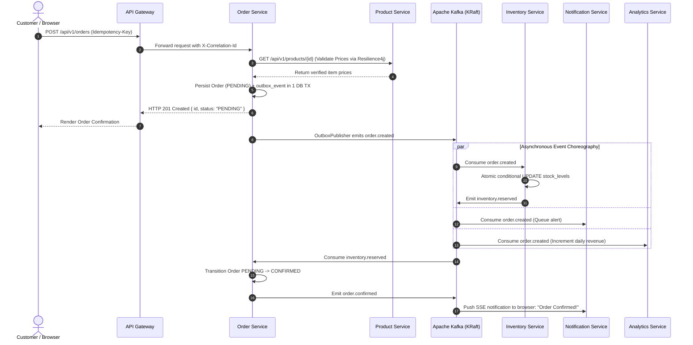
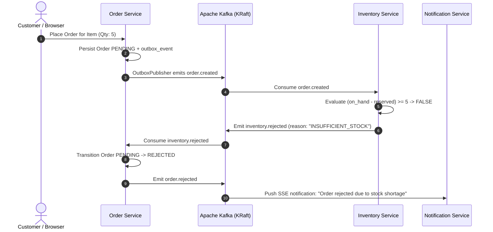
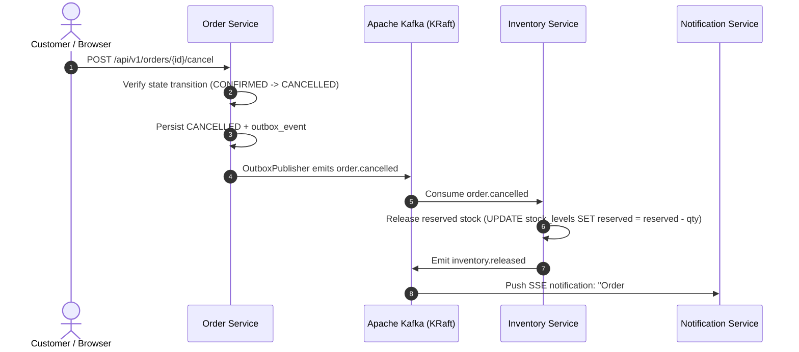
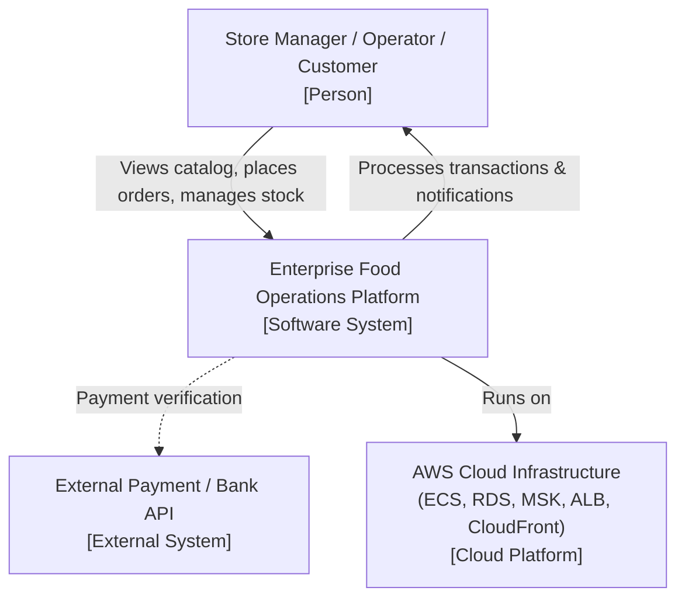
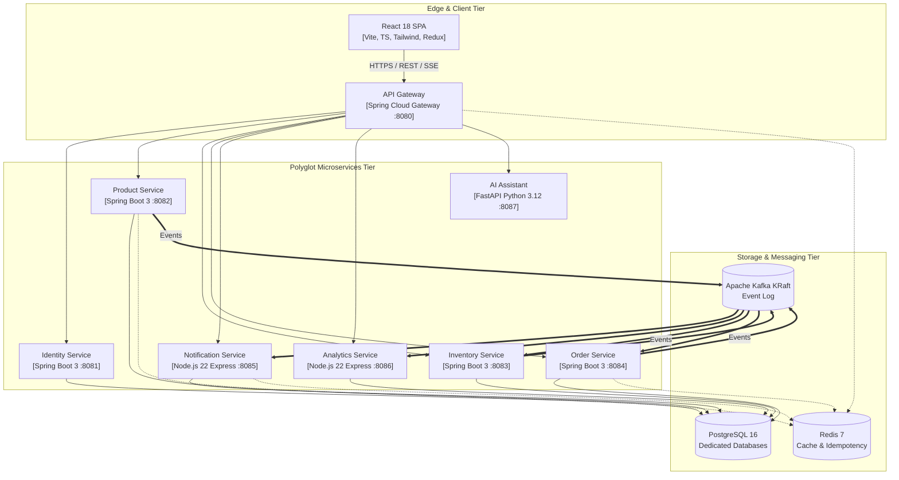

# Event Catalogue & Architecture Sequence Diagrams

## 1. Domain Event Catalogue

All events in the Enterprise Food Operations Platform adhere to a standardized JSON event envelope and are published with partitioned keys to preserve ordering per aggregate root.

### Event Envelope Format (`contracts/events/`)
```json
{
  "eventId": "uuid-v4",
  "eventType": "domain.event.name",
  "version": 1,
  "occurredAt": "2026-10-04T15:30:00.000Z",
  "correlationId": "uuid-v4",
  "producer": "service-name",
  "payload": {}
}
```

### Complete Event Registry

| Topic Name | Producer | Consumers | Partition Key | Payload Summary |
|---|---|---|---|---|
| `order.created` | `order-service` | `inventory-service`, `notification-service`, `analytics-service` | `orderId` | `{ orderId, customerId, totalAmount, currency, items: [{ productId, qty, unitPrice }] }` |
| `order.confirmed` | `order-service` | `notification-service`, `analytics-service` | `orderId` | `{ orderId, customerId, status: "CONFIRMED", confirmedAt }` |
| `order.rejected` | `order-service` | `notification-service`, `analytics-service` | `orderId` | `{ orderId, customerId, reason, status: "REJECTED" }` |
| `order.cancelled` | `order-service` | `inventory-service`, `notification-service`, `analytics-service` | `orderId` | `{ orderId, customerId, status: "CANCELLED", cancelledAt }` |
| `inventory.reserved` | `inventory-service` | `order-service`, `analytics-service` | `orderId` | `{ orderId, warehouseId, reservations: [{ productId, qty, stockLevelId }] }` |
| `inventory.rejected` | `inventory-service` | `order-service`, `analytics-service` | `orderId` | `{ orderId, reason: "INSUFFICIENT_STOCK", unavailableProductIds: [] }` |
| `inventory.released` | `inventory-service` | `analytics-service` | `orderId` | `{ orderId, releasedAt }` |
| `inventory.low-stock` | `inventory-service` | `notification-service`, `analytics-service` | `productId` | `{ productId, warehouseId, currentStock, threshold }` |
| `product.updated` | `product-service` | `inventory-service`, `order-service` | `productId` | `{ productId, sku, name, price, active, updatedAt }` |

---

## 2. Order Lifecycle Sequence Diagrams

### 2.1 Happy Path Flow (Order Placement to Confirmation)


---

### 2.2 Rejection Path (Insufficient Stock)


---

### 2.3 Cancellation & Compensation Path


---

## 3. C4 Architecture Diagrams

### 3.1 C4 Level 1: System Context Diagram


### 3.2 C4 Level 2: Container Diagram

